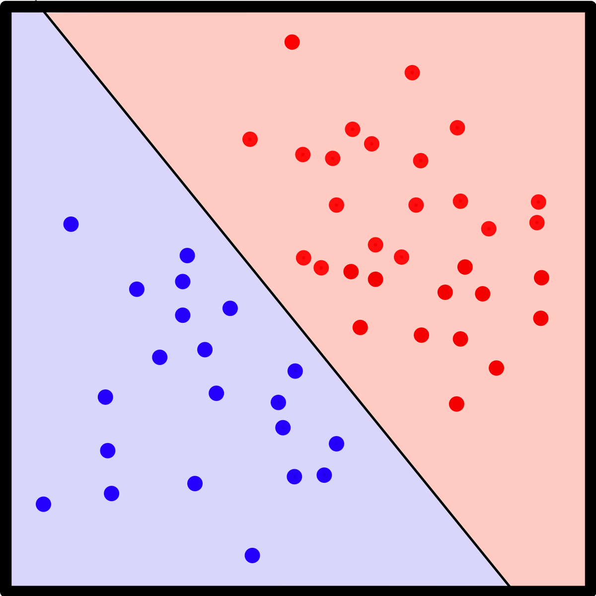

### Q1
#### 2a)
The perceptron is only able to solve linearly separable problems, that is, ones that can be separated by a line or hyperplane. It applies the idea of placing a straight line boundary in the feature space and, when given a new point, the model checks the side of the boundary where it falls. However, perceptrons cannot model nonlinear functions (such as the logical XOR operation).

That limitation of the perceptron does not apply to feedforward networks with intermediate or "hidden" non-linear units, also called **Multilayer Perceptrons (MLP)**. MLP is a neural network where the mapping between inputs and output is non-linear.
As such, MLP is more expressive in a sense that it can represent non-linear functions, as long as its units use non-linear activation functions.
However, if the activation function of the multi-layer perceptron is linear (multiple layers of cascade linear units), it will only be able to represent linear functions.
In conclusion, the MLP only overcomes the perceptron's limitation of only representing linear functions, if its units use non-linear activation functions.

(referencias: livro de ap do ano passado, https://towardsdatascience.com/multilayer-perceptron-explained-with-a-real-life-example-and-python-code-sentiment-analysis-cb408ee93141)